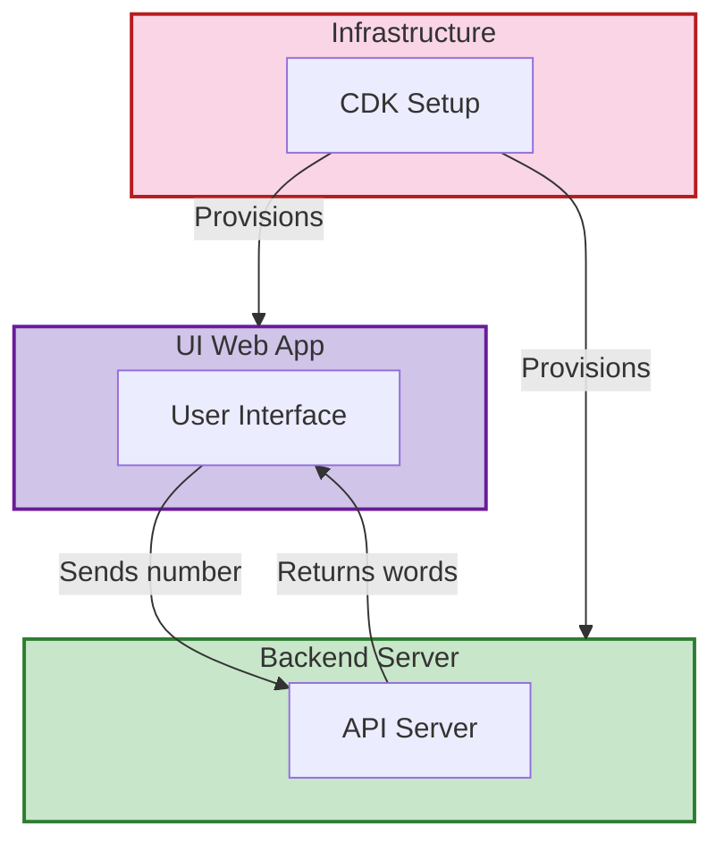
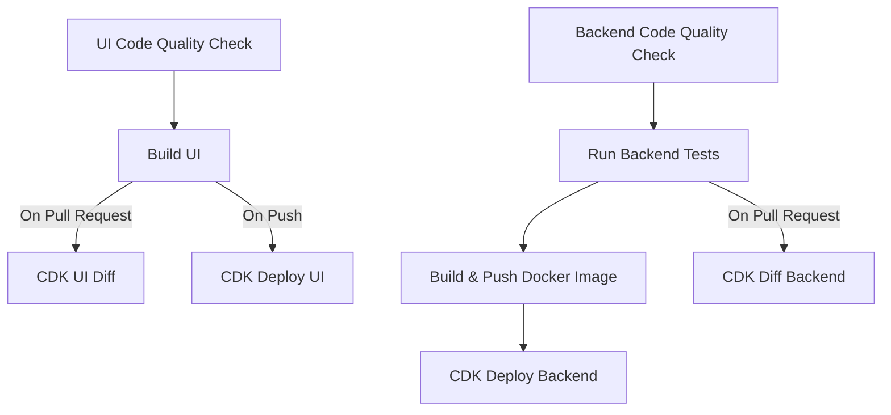

# Trellis Law


## Quick Links 🚀

- **🌐 Web Application UI**: [Access the web app here!](https://number2word.luisguilher.me/)
- **📚 Documentation**: [Dive into the docs here!](https://word2vector.luisguilher.me/docs)
- **🔗 API Example**: [See '42' become 'forty-two'](https://word2vector.luisguilher.me/num_to_english/42)

## Overview

This repository hosts a full-stack application designed to convert numeric values into their corresponding English word representation. The back-end is built using Django, exposing two primary API endpoints that allow users to input numbers and receive them as written words. The front-end is a Vue/Nuxt application that provides a user-friendly interface for real-time interaction with the API. The project also includes infrastructure-as-code for AWS deployment using AWS Cloud Development Kit (CDK).

### Components



## CI/CD Pipeline

Our CI/CD pipeline, built with GitHub Actions, manages automated testing, building, and deployment for both the frontend and backend of the Trellis-Law project. It triggers on pushes to the `main` branch and on pull requests to ensure all changes are properly vetted before deployment.

### Workflow Steps



#### UI

- **UI Code Quality Check**: Validates frontend code using linting tools.
- **Build UI**:
  - On pull requests: Performs infrastructure difference checks (`CDK UI Diff`).
  - On pushes to main: Deploys static files to an S3 bucket (`CDK Deploy UI`).

#### Backend

- **Backend Code Quality Check**: Runs tools like `mypy` and `flake8` to ensure code standards.
- **Run Backend Tests**: Executes Django unit tests to verify functionality.
- **Build and Push Docker Image**: On main branch pushes, builds and pushes the Docker image.
- **CDK Backend Deployment**: Deploys backend infrastructure using AWS CDK.

### Conditional Execution

- **CDK Diff Jobs**: Display infrastructural changes on pull requests.
- **Deploy Jobs**: Triggered on main branch pushes to update live environments.

This streamlined CI/CD approach ensures that all parts of our system maintain high integrity and are ready for production deployment.

- **API backend:** A Django application with endpoints to convert numbers into words.
- **Frontend:** A Vue/Nuxt application that interacts with the Django API.
- **Infrastructure:** CDK scripts for deploying the application on AWS.

### Project Structure

- `/backend`: Contains the Django application with all necessary configurations for the API backend. Please refer to the `README.md` in this folder for detailed information on setup, usage, and API documentation.
- `/ui`: Houses the Vue/Nuxt application code. The `README.md` in this folder provides instructions on installation, running the app locally, and building for production.
- `/infra`: Includes the CDK deployment scripts for setting up AWS infrastructure. Check the `README.md` here for details on deploying the application to AWS.

## Getting Started

To begin using this project, follow these steps:

1. **Clone the Repository:**

   ```
   git clone git@github.com:lguibr/trellis-law.git
   cd trellis-law
   ```

2. **API Server Setup:**
   Navigate to the `/backend` directory and follow the instructions in the `README.md` to set up the Django server.

3. **Frontend Setup:**
   Move to the `/ui` folder and follow the setup instructions detailed in the `README.md` to get the frontend running.

4. **Infrastructure Setup:**
   Enter the `/infra` directory and follow the deployment instructions in the `README.md` to deploy the application using AWS CDK.

## High-Level Functionality

- **Convert Numbers to Words:**

  - **GET `/num_to_english?number=<number>`:** Returns the English word representation of the provided number.
  - **POST `/num_to_english`:** Accepts a JSON object with a "number" key and returns the English word representation.

- **Frontend Interaction:**
  - The landing page allows users to input a number and displays the English words immediately on path /number=<number> and after a 5-second delay with a loading spinner when accessing root and filling a number.

## Requirements

- Python 3.11
- Django 5.X
- Vue.js 3.x/Nuxt.js 2.x
- AWS Account for deploying with CDK
- Node.js 18.x+ for frontend development

## License

This project is licensed under the MIT License - see the [LICENSE](LICENSE) file for details.
