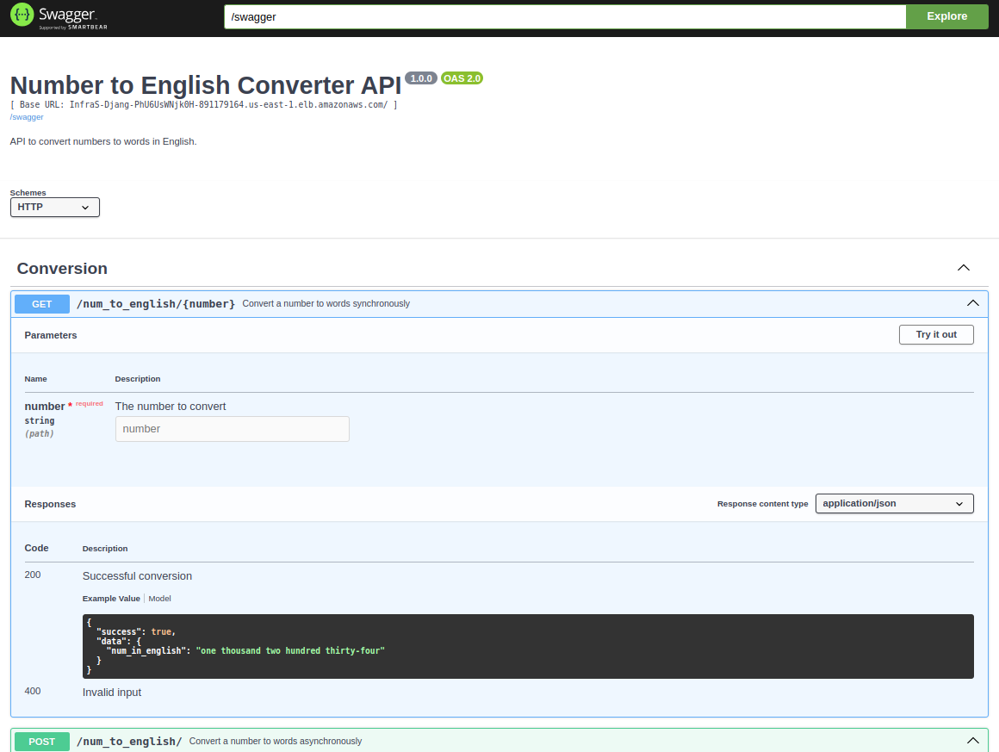

# Trellis Law Server

This project is a Django-based web application designed for number conversion to words. It includes a robust Docker setup, Mypy for static type checking, Pytest for testing, and is configured for both development and production environments.

## Prerequisites

Before you begin, ensure you have installed:

- Docker
- Python 3.11+
- pip

## Quick Start

To get this project up and running locally on your machine:

1. **Clone the repository**:

   ```
   git clone git@github.com:lguibr/trellis-law.git
   cd trellis-law/backend
   ```

2. **Build the Docker container**:

   ```
   docker build -t trellis-law-server .
   ```

3. **Run the Docker container**:
   ```
   docker run -p 8000:8000 trellis-law-server
   ```

You should now have the application running and accessible at `http://localhost:8000/`.

## API Documentation

Access the API documentation and interact with the API through the Swagger UI:



- **Swagger JSON**: http://localhost:8000/swagger/
- **Swagger UI**: http://localhost:8000/swagger-ui/

These endpoints provide a visual interface for the API's endpoints, allowing for easy testing and exploration of its functionalities.

## Configuration Files

- **`conf/common`**: Contains the common settings for the DEV and PROD environments of Django application.
- **`conf/dev`**: Contains the settings for the DEV environment of Django application.
- **`conf/prod`**: Contains the settings for the PROD environment of Django application.
- **`.env`**: Define the environments variables used on the application, please use the `.env.example` as template.
- **`mypy.ini`**: Configures Mypy with Django support to enhance type checking across the application.
- **`pyproject.toml`**: Configures import sorting rules to maintain clean and consistent code and defines settings for running Pytest, such as Django environment setup and test file patterns.
- **`dockerignore`**: Lists files and directories to be ignored by Docker builds to reduce build context size.

## Development Setup

For local development, follow these steps:

1. **Environment Variables**:

   - Copy the `.env.example` file to `.env` and adjust the environment variables as needed.

2. **Install dependencies**:

   ```
   pip install -r requirements/dev.txt
   ```

3. **Install pre-commit**:

   ```
   pre-commit install
   ```

4. **Run the development server**:

   ```
   python manage.py runserver
   ```

5. **Run tests**:

   ```
   python manage.py test
   ```

6. **Type check**:
   ```
   mypy .
   ```

## Files and Directories

- **`manage.py` and `manage.prod.py`**: Entry points for Django's administrative tasks for development and production.
- **`backend/` directory**: Contains WSGI and ASGI configurations for different environments, URL routes, and settings split across common, dev, and prod modules.
- **`number2word/` directory**: Houses the Django app for number conversion logic, including views, URL mappings, tests, and utility modules.

## Deployment

Before deploying the application, ensure that all necessary environment variables are set. These variables configure the application settings for production according to `backend/conf/prod.py`.

### Deploying with Docker

Deploying with Docker simplifies setting up the environment and dependencies. Follow these steps to build and run the Docker image:

1. **Set environment variables**:
   Set the production environment variables directly or use a `.env` file to load them when starting the Docker container.

2. **Build the Docker image**:

   ```
   docker build -t trellis-law-server .
   ```

3. **Run the Docker container**:
   ```
   docker run -p 8000:8000 --env-file .env trellis-law-server
   ```

This will start the server bound to port 8000 of your host, making the application accessible at `http://localhost:8000/`.

### Deploying without Docker

For environments where Docker is not used, follow these steps to manually set up and run the server using Gunicorn and Uvicorn:

1. **Set environment variables**:
   Define all required production environment variables as specified in `backend/conf/prod.py`.

2. **Install dependencies**:

   ```
   pip install -r requirements/prod.txt
   ```

3. **Run the ASGI server using Gunicorn**:
   ```
   gunicorn backend.asgi:application -w 4 -k uvicorn.workers.UvicornWorker --bind 0.0.0.0:8000
   ```

This approach starts the server with four workers, suitable for handling production traffic using ASGI.

## License

This project is licensed under the MIT License - see the [LICENSE](./../LICENSE) file for details.
