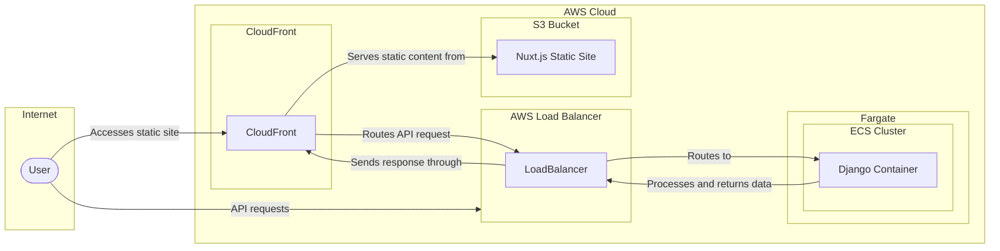

# Infrastructure Trellis-Law Project

This repository contains the AWS Cloud Development Kit (CDK) infrastructure code located in the `infra` folder. It is designed to deploy and manage the cloud resources necessary for both the frontend and backend components of the Trellis-Law project.

## Overview of Stacks



The `infra` folder includes two CDK stacks:

### 1. InfraStack (Backend Services)

This stack is responsible for setting up the backend infrastructure on AWS, utilizing services such as Amazon ECS, EC2, and Application Load Balancers.

**Key Components:**

- **VPC (Virtual Private Cloud)**: Configured to ensure isolated network environment within AWS.
- **ECS Cluster (Elastic Container Service)**: Manages Docker containers for the backend services.
- **Application Load Balanced Fargate Service**: Automates the deployment, management, and scaling of containers using Fargate.

**Environment Setup:**

- Configures environment variables for Django settings, database connections, and more.

### 2. UiAppDeploymentStack (Frontend Application Deployment)

This stack manages the deployment of the frontend static files to an Amazon S3 bucket and sets up CloudFront to serve these files and route API requests.

**Key Components:**

- **S3 Bucket**: Stores and serves the frontend static files with a configured website index document for SPA (Single Page Application) support.
- **CloudFront Distribution**: Configures CloudFront to serve static content from S3 and route API requests to the backend load balancer.
- **IAM Policy**: Ensures public read access to the S3 bucket.
- **Bucket Deployment**: Facilitates the deployment process from local build directories to the S3 bucket.
- **CfnOutput**: Provides the URLs where the frontend application and API are accessible via CloudFront.

## Prerequisites

- AWS CLI installed and configured with necessary access credentials.
- Node.js and npm installed.

## Deployment Instructions

1. **Navigate to the infra directory:**

   ```bash
   cd trellis-law/infra
   ```

2. **Install dependencies:**

   ```bash
   npm install
   ```

3. **Bootstrap your AWS environment (if first time using CDK in the region):**

   ```bash
   cdk bootstrap
   ```

4. **Check for changes before deployment:**
   Use the `diff` command to see what changes will be applied to your AWS environment based on the current state of the CDK code compared to the last deployed state.

   ```bash
   cdk diff
   ```

5. **Deploy the Backend InfraStack:**

   ```bash
   cdk deploy InfraStack
   ```

6. **Deploy the Frontend UiAppDeploymentStack:**
   ```bash
   cdk deploy UiAppDeploymentStack
   ```

## Additional Information

- Ensure that the AWS region and account settings are correct before deploying.
- Consider the AWS service costs associated with deploying these resources.
- Customize environment variables and other settings as needed to fit the specific requirements of the Trellis-Law project.

## Next Steps

### RDS PostgreSQL Instance

We aim to incorporate an Amazon RDS PostgreSQL instance to provide a scalable, secure, and durable database solution for the backend. This will facilitate handling higher volumes of data with improved performance compared to traditional database setups.

### AWS Secrets Manager

To enhance security, we will utilize AWS Secrets Manager for managing sensitive information such as database credentials and API keys. This integration will help automate the process of rotating, managing, and retrieving secrets throughout their lifecycle, ensuring our application's sensitive data is protected.
