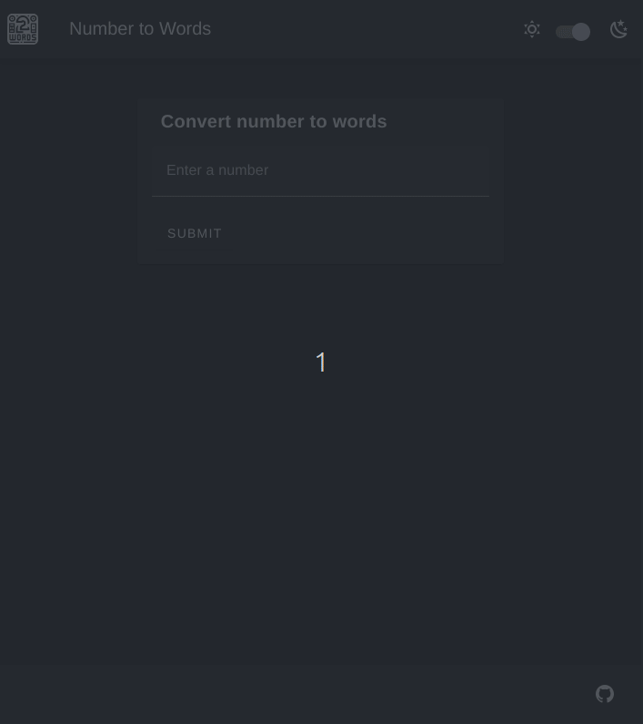

# Trellis-Law UI Web App

This Vue/Nuxt/Vuetify web app converts numbers to words. It's built for efficiency with front-end validations and snappy page transitions that keep the UI responsive and interactive. Access the current deploy at [link](https://dj1fxvjqor00d.cloudfront.net/)



## Key Pages

### Home Page

- **Form**: Users can submit numbers. Valid entries trigger a spinner for 5 seconds as the system processes the request.
- **Error Handling**: Errors from invalid input or backend issues are displayed with guidance for correction or re-submission.

### Result Page

- **Display**: Shows the number in words.
- **Clipboard**: An option to copy the text with a confirmation via snackbar.

## Features

- **Persistent UI Components**: Snackbar, Modal, and Spinner enhance the UX during navigation.
- **Static Generation**: Employs Nuxt's static generation for faster loading and SEO benefits.

## Structure

```
/ui
|-- components/
|   |-- core/
|   |   |-- Card.vue
|   |   |-- Logo.vue
|   |   |-- Modal.vue
|   |   |-- Spinner.vue
|   |-- home/
|   |   |-- Form.vue
|   |   |-- View.vue
|   |-- result/
|   |   |-- View.vue
|   |   |-- CopyDisplay.vue
|-- layouts/
|   |-- default.vue
|-- pages/
|   |-- index.vue
|   |-- result/
|   |   |-- [number].vue
|-- plugins/
|   |-- vuetify.ts
|   |-- useEmitter.js
|-- nuxt.config.js
```

## Usage

1. **Setup**: Install dependencies with `npm install`.
2. **Development**: Start the server with `npm run dev`.
3. **Production**: Build with `npm run build` and preview with `npm run preview`.

## Contributing

Contribute by submitting pull requests or reporting issues. [View license here](./../LICENSE).

## Next Steps

### Playwright E2E Tests

We plan to integrate Playwright for end-to-end testing to ensure all functionalities perform as expected across all major browsers. This will help maintain the robustness of the application as new features are developed.

### Storybook for Component Showcase

Implementing Storybook will allow us to develop and showcase UI components in isolation, making it easier to visualize changes and improve UI consistency without deploying the full application.

### Enhanced State Management

As the application scales, a more robust state management solution will be necessary. We are considering upgrading to Pinia, which offers a more flexible and dev-friendly approach compared to traditional Vuex-based management in Vue/Nuxt applications.
